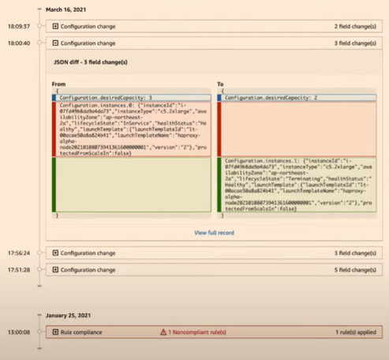
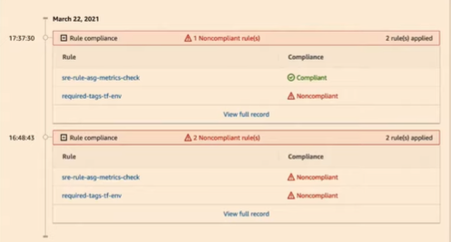
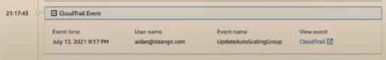
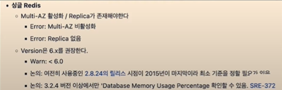
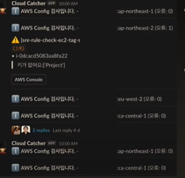
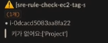

# AWS Config를 이용한 컴플라이언스 기반 리소스 관리

[해당 영상](https://www.youtube.com/watch?v=4VtMoNKx2tM) 보고 정리

## Compliance?

- 컴플라이언스 관리는 기업 및 규제 기관의 정책과 요구 사항 뿐 아니라 

  업계 표준을 준수하는 시스템을 만들기  위해

  지속적으로 시스템 모니터링하고 평가하는 프로세스

- 겪는 불편함
  1. 사내 표준 가이드대로 만들긴 했는데 어떻게 보장하지?
  2. 누군가의 실수로 잘못된 설정을 가진 리소스가 존재하면 어쩌지?
  3. 글로벌 서비스를 해야하는데 각 국가별 규정이 너무 많은데?

## Continuous Compliance with AWS

- 지속적인 컴플라이언스는 많은 cost를 아낄 수 있음
  - 정기적인 Audit(감사)을 위해 모두가 시간을 낼 필요가 X
  - 전통적인 컴플리언스는 다양한 부서와 정기적으로 가이드 회의를 해서 시간이 많기 뺐겼음
- 일 단위, 필요하다면 더 작은 단위로도 컴플라이언스 평가 가능
- 평가후 교정 액션을 활용하면 자동으로 위반된 리소스를 교정

## Compliance as Code

- 코드 기반의 체크리스트(규칙)
  1. 일관된 기준으로 리소스를 평가할 수 있음
  2. 기준이 변경된다면 코드를 수정하면 됨
  3. 평가 대상의 기준 준수여부를 빠르게 얻을 수 있음
- 마이크로 아키텍처에서는 다양한 기능들이 다양한 규칙(혹은 개발 정책)을 가지고 있기에 코드 기반으로 빠르게 규칙을 수정하는게 효율적임

## AWS Config Concepts

- 컨피그레이션 레코드로 각 서비스 별로 설정 정보 스냅샷
- 해당 스냇샷은 Configuration Isolation으로 저장
- AWS Config는 Configuration Isolation을 저장하는 인벤토리와 인벤토리를 평가하는 규칙으로 구성

## AWS Config Resource

- Supported Resource
- Unsupported Resource
  - Custom Rule을 사용해서 지원하지 않은 것도 사용할 수 있긴 함

## Resouce Inventory(TimeLine)

- 해당 리소스에 대한 CloudTrai Event,

  설정 변경사항, 컴플라이언스 변동사항에 대한 기록을 보여줌

  - 리소스 History 볼 때 유용

### 설정이 바뀌었을 때 예시

</img>

- 크게 3가지의 이벤트 타입으로 구성
  1. Configuration 이벤트
     - 규칙 변경시 히스토리 기록
  2. Compliance 이벤트
     - 각 리소스가 규칙을 준수하고 있는지 판단
  3. 클라우드 트레일 액션
     - 클라우드 트레일 변경사항을 기록

</img>

- 규칙을 잘 지키면 Complianat 아니면 Non

- 16시 sre-rule...이 Non이었지만 

  17시에 Custom Rule로 기준을 바꿔서 Complianat이 됨

</img>

- 클라우드 트레일 이벤트
  - 무엇이 변경 됐는지 확인 할 수 있음

## Rule 

### 1. Type

1. Managed Rule
   - AWS에서 미리 제공해주는 규칙
   - 따라서 Parameter만 넣으주면 바로 평가 됨

2. Custom Rule
   - Lambda를 통해 동작
   - 복잡하고 다양한 Case에 대해 평가 가능
   - Custom Rule 생성은 AWS에서 제공하는 Rule Development Kit을 통해 쉽게 개발 가능

### 2. Trigger  Types

1. Change Triggers
   - 지원되는 리소스에서 사용 가능
   - 변경 후 1-2분 정도의 Near Real-time으로 평가가 됨
2. Time Triggers
   - Cron처럼 주기적으로 Trigger
     - 수동으로도 가능

### 3. Remediation(교정)

- Automatic, Manual Remediation
  - Rule을 준수하지 않은 리소스는 서비스가 멈추지 않게 AWS Systems Manager의 Automation을 통해 교정할 수 있음
- 개별 Remediation도 가능

### 4. Conformance packs

- AWS Config의 Rule을 묶어놓은 패키지
- 구성된 규칙들의 개별 준수여부를 체크해줌
-  Conformance pack 자체의 timeline등을 제공

## RDK(Rule Development Kit)

- AWS Config의 Custom Rule 개발 도구

- Rule 개발시 필요한 리소스(IAM role, lambda, Cloudwatch log 등)를 자동으로 배포

  - CloudFormation을 통해 배포

- Rulesets 기능:

  여러 rule을 한 번에 배포 가능

- 개발, 테스트코드, 배포, 로그 조회를 한 번에 할 수 있음

## 🥕 룰북

</img>

- AWS/K8S/Terraform에서 지켜야하는 규칙을 작성

  - AWS 규칙 관련 내용:

    IAM Role, RDS, SSM, S3, ACM, EC2, ElastiCache 등의 리소스 설정 기준 등을 작성

- Cloud 파트는 AWS Config를 통해 모든 규칙을 관리하는 것을 목표로 하고 있음
  - 커스텀 룰은 RDK를 통해 개발/배포하고 있음

### 당근마켓 대표 룰 예시

- Auto Scaling Group 지표 활성화

  - 매트릭 활성화 상태 관리

- Access Key age가 90일 미만으로 지정

  - 90일 초과하면 Compliance 이벤트에서 Non으로 뜸

- Redis 특정 버전만 사용하기

- CloudFront의 default root object 설정 여부 체크

- 리소스 Tag

  - AWS Tag Policy 사용하면 되지 않나요?

    - 리소스 Tag 입력시 key와 value를 정해놓음

      정해진 value값만 들어오게 설정

  - 빌링 관련 태그

  - Stage(Phase) Env 정보

- 🎸등등

### 룰북 활용 심화 예시

</img>

- slack을 통해 매일 아침 10시에 정해진 Rule에 대한 평가 결과를 게재

  - 24시간마다 트리거 on!

- 태그에 정해진 key와 대응되는 value가 있어야함

  
</img>

  - `sre-rule-check-ec2-tag`에 `Project`란 키가 없음을 알 수 있음

- 타임라인 기능을 통해 장애 대응에 도움을 줌

### 사용해보면서 느낀점

- 당근은 Terrafrom을 주력으로 사용하는데

  RDK는 Cloudformation을 사용해야 해서

  테라폼으로 aws config 관리가 힘듬

  - aws config는 테라폼으로 관리하지 않기로 결정

- Rule을 Name으로 검색 X
  - 룰북 하위에 Config Rule 링크를 별도로 관리
  - Rule 관리를 위한 다른 툴이 필요

## Advanced Approach

- `bridgecrew` 
  - IaC(테라폼) 코드 추적을 통해 위반 사항 찾아줌
  - aws config는 만들어진 사항에서만 관리를 하는 것이므로 내부 사항을 관리할 때 이용
- `AWS Control Tower`
  - aws config가 제공하는 통합된 보안 관리 서비스
- 꼭 보안으로만 접근할 필요x 다양한 정책에 활용 가능

## 비용

- 극히 적음, 전체 지불 예상 중 0.n% 사용 (200-500$)
  - (전체 클라우드 예산은 500000$ 정도 되는건가🤔)
- 관리하고 싶은 리소스만 선택해서 관리 가능
- 비용 정책은 Conformance pack(rule 패키지) 사용 기준이어서 rule이 많지 않으면 저렴

